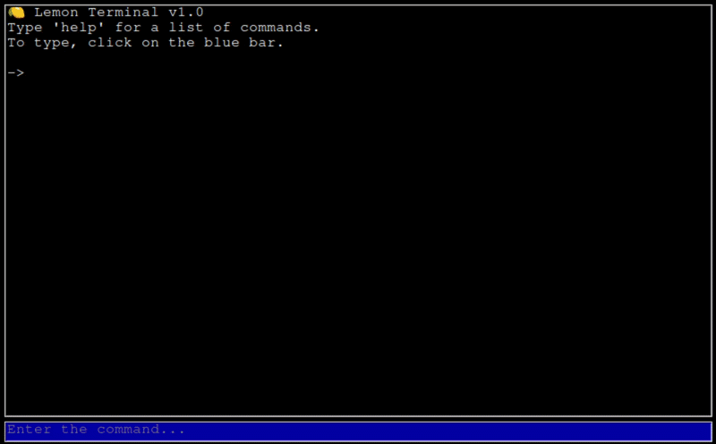

# Лимон Терминал
Lemon Terminal - это простой и понятный терминал, созданный для тех, кто только начинает изучать командную строку. Когда я впервые начал пользоваться компьютером, я не понимал, как работают CMD и терминалы. Этот проект — моя попытка сделать процесс обучения более простым и увлекательным.

Разные языки / Other Languages: [English](README.md) • [Русский](README.ru.md)


         





---

## Скачать

- **Windows** - `LemonTerminal.exe` 	*Нестабильная версия*
- **Linux** - `LemonTerminal`

---


### Это бета-версия для тестирования!

Программа находится в активной разработке, поэтому ваша система Linux может отображать предупреждение «Неизвестный тип файла». Это нормально для бета-тестирования.

**Для запуска терминала:**
1. Нажмите правой кнопкой мыши на файл -> Свойства -> Права.
2. Отметьте пункт «Разрешить выполнение файла как программы».


---

## Запуск

Откройте файл. Введите `help` для вывода списка команд.

---


## Доступные команды

Вы можете использовать следующие встроенные команды для управления вашей системой, файлами и внешним видом терминала.

### SYSTEM
* **`sysinfo`** - Показать детальные характеристики оборудования ПК.
* **`memory`** - Отобразить текущий статус оперативной памяти (RAM).
* **`cpu`** - Показать модель процессора и текущую загрузку процессора.
* **`disk`** - Проверить доступное место на дисках.
* **`ip`** - Отобразить текущий IP-адрес вашего устройства.

---

### FILES
* **`ls`** - Показать список всех файлов и папок в текущей директории.
* **`cd`** - Перейти в другую папку.
* **`mkdir`** - Создать новую папку.
* **`rmdir`** - Удалить пустую папку.
* **`touch`** - Создать пустой файл.
* **`cat`** - Прочитать и вывести содержимое текстового файла.
* **`echo`** - Вывести введенный текст на экран.
* **`writefile`** - Записать текст напрямую в файл.

> **ВНИМАНИЕ! ОПАСНАЯ КОМАНДА!**
> * **`rm`** / **`-rf`** - Безвозвратное принудительное удаление файлов или папок вместе со всем их содержимым. Используйте с крайней осторожностью; удаленные данные не могут быть восстановлены!

---

### THEMES
* **`fullscreen`** - Переключить полноэкранный режим для окна терминала.
* **`font size`** - Изменить размер шрифта интерфейса.
* **`theme <classic>`** - Включить стандартную черно-синюю тему.
* **`theme <lemon>`** - Включить лимонно-желтую тему.
* **`theme <forest>`** - Включить зеленую лесную тему.
* **`theme <night>`** - Включить темную ночную тему.
* **`theme <light>`** - Включить чистую светлую тему.

---

### TOOLS
* **`date`** - Отобразить текущую дату.
* **`calc`** - Запустить встроенный математический калькулятор.
* **`random 3`** - Сгенерировать случайное число от 1 до 3.
* **`random 10`** - Сгенерировать случайное число от 1 до 10.
* **`random 100`** - Сгенерировать случайное число от 1 до 100.

---

### TERMINAL
* **`ver`** - Показать текущую версию Lemon Terminal.
* **`clear`** - Полностью очистить экран консоли.
* **`exit`** - Закрыть приложение и выйти из терминала.
* **`help`** - Отобразить общий список всех доступных категорий команд.
* **`help <directory>`** - Показать справочную документацию для конкретной категории (например, `help files`).


---

## Разработчикам

```bash
python3 lemon.py
```
